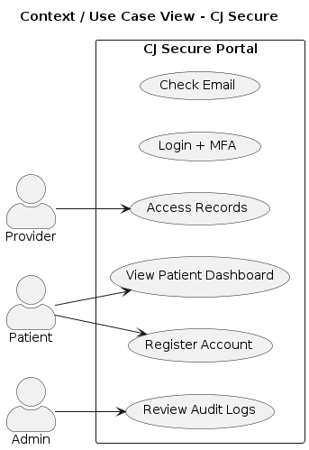
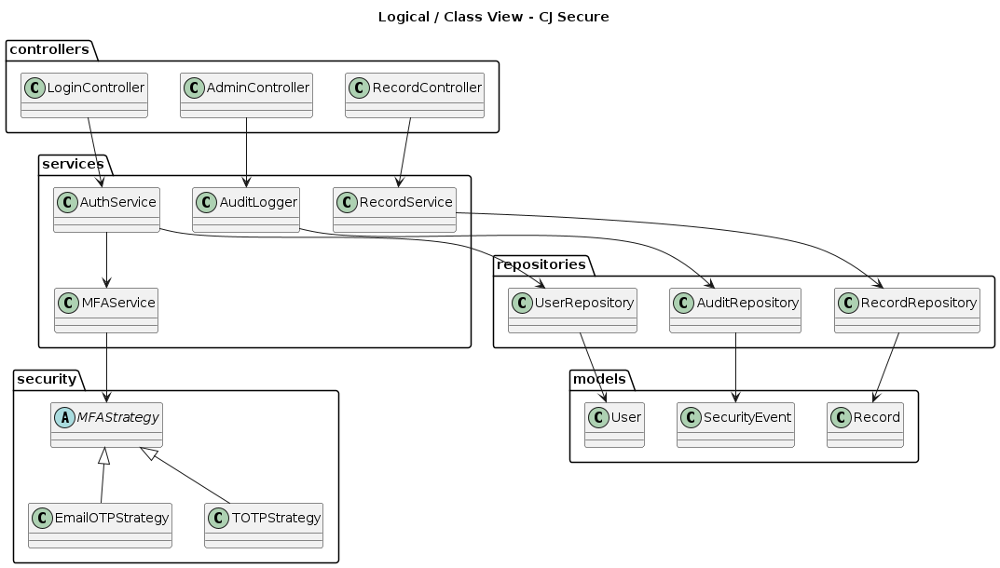
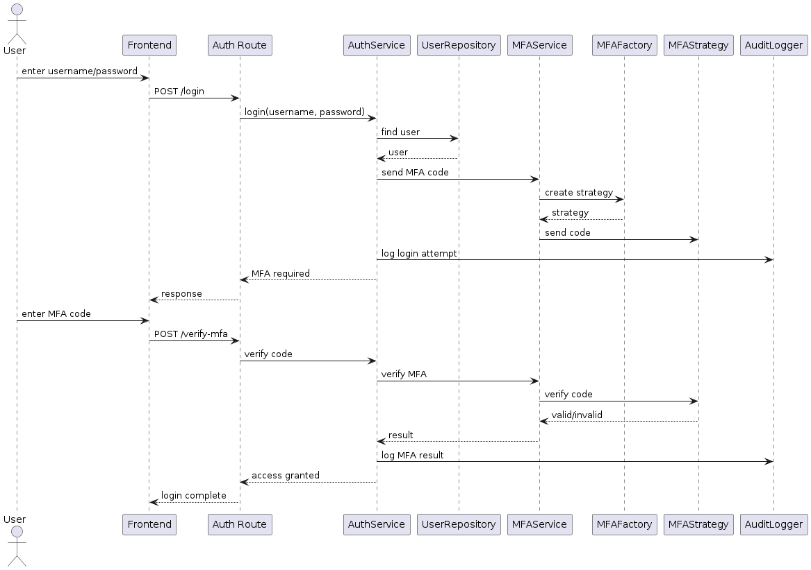
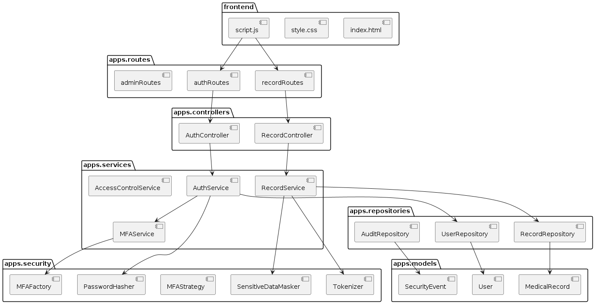
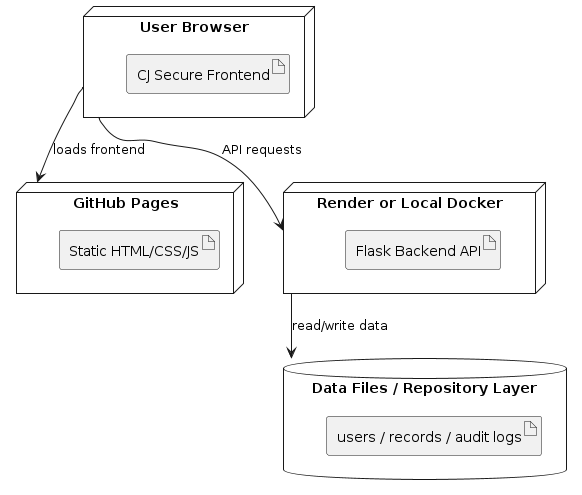

# CJ Secure

## Secure Access Portal for CJ Hospital

## Team Information

**Course:** CSCI 375 OOP and Design Patterns  
**Project Type:** Final Project / Student Showcase  
**Team Members:**

* Lia “Chica” Gomes
* Janet Griffin

## Overview

CJ Secure is a healthcare-focused security application designed for CJ Hospital. The system protects sensitive hospital-style information through layered security controls including username and password authentication, multi-factor authentication, role-based access control, audit logging, and secure handling of medical records.

The project demonstrates how object-oriented design can be used to build a modular, security-centered system for patients and providers in a hospital environment.

## Problem Statement

Traditional username-and-password authentication alone is not sufficient for systems that store protected medical or patient-related information. Weak passwords, unauthorized access, and poor audit visibility create major security risks in healthcare environments.

CJ Secure addresses that problem by implementing:

* Secure username and password authentication
* Multi-factor authentication
* Role-based access control
* Audit logging of security-related events
* Masking and tokenization of sensitive identifiers
* Protected access to hospital medical records

## Features

* Username and password login
* Email-first account lookup
* User registration
* Multi-factor authentication through email OTP or TOTP demo mode
* Role-based access control
* Protected medical record retrieval for provider users
* Audit-log review for admin users
* Sensitive data masking
* Sensitive data tokenization
* Flask backend API
* Static HTML, CSS, and JavaScript frontend
* Unit testing and property-based testing
* Dockerized backend setup
* GitHub Actions CI for style checks, type checks, tests, and coverage

## Healthcare Demo Focus

CJ Secure is presented as a hospital security portal for CJ Hospital. The frontend experience is designed around role-based views, including:

* Provider dashboard
* Patient dashboard
* Admin dashboard

The current seeded demo accounts are:

| Username | Password | Role | Best Demo Use |
|---|---|---|---|
| `alice` | `password123` | `provider` | Provider record-access demo |
| `bob` | `password123` | `patient` | Patient dashboard demo |
| `admin` | `admin123` | `admin` | Audit-log review demo |

At the moment, the backend stores `alice` with a provider role. This makes `alice` best for demonstrating protected medical-record retrieval. The admin account is the correct account for demonstrating audit-log access.

## MFA Demo Behavior

CJ Secure supports two MFA modes:

| MFA Mode | How It Works | Demo Notes |
|---|---|---|
| `totp` | Uses the backup demo TOTP strategy | Docker Compose defaults to this mode unless `MFA_METHOD=email` is set |
| `email` | Sends a one-time code through SendGrid | Requires `SENDGRID_API_KEY` and `FROM_EMAIL` environment variables |

For the simplest class demo, use TOTP mode and enter this code:

```text
654321
```

For the email demo, set the SendGrid environment variables and use `MFA_METHOD=email`.

## Team Responsibilities

| Area / Feature | Janet | Chica |
|---|---|---|
| Project Coordination | Task planning, repo management, integration support | Task updates, testing, issue tracking, integration support |
| Backend Architecture | Flask API, services, repositories, route/controller structure | Security behavior, audit logging, RBAC integration, testing support |
| Authentication and MFA | Login/MFA backend flow, SendGrid/TOTP integration | Secure UI flow, MFA demo testing, security validation |
| Role-Based Access Control | Backend role enforcement support | UI restrictions, provider/patient/admin dashboard behavior, access testing |
| Audit Logging | Logger integration and Singleton pattern support | File-backed audit behavior, browser/action logging, validation |
| Data Security | Backend integration support | Masking, tokenization, protected-record behavior |
| API Development | Auth, records, and admin route support | Secure API calls, frontend integration, endpoint testing |
| Frontend Development | Deployment support | Static HTML, CSS, and JavaScript interface and user experience |
| Testing and Quality | Backend/unit testing support | Security tests, route tests, CI fixes, coverage improvements |
| Deployment | Render/backend setup support | GitHub Pages/frontend workflow and Docker/Codespaces testing |
| UML and Design Patterns | Backend/design-pattern contributions | UML diagrams, design analysis, security design explanation |

## Tools Used

* GitHub for version control and collaboration
* GitHub Issues for task tracking
* GitHub Pull Requests for code review and integration
* GitHub Actions for CI checks
* Docker and Docker Compose for backend environment setup
* Flask for the backend API
* HTML, CSS, and JavaScript for the frontend
* SendGrid for email MFA support
* pytest and Hypothesis for testing
* flake8 for style checking
* mypy for type checking
* pytest-cov for test coverage
* pdoc for backend documentation
* PlantUML for UML diagrams
* Render for backend hosting setup
* GitHub Pages for frontend hosting setup

## Architecture Overview

The project uses a layered object-oriented architecture.

### Backend

The backend is organized into:

* `apps/routes/` for API endpoints
* `apps/controllers/` for request coordination
* `apps/services/` for business logic
* `apps/repositories/` for data access
* `apps/models/` for domain entities
* `apps/security/` for hashing, MFA strategies, masking, and tokenization
* `apps/main.py` for Flask application setup

### Frontend

The static frontend is organized into:

* `frontend/index.html`
* `frontend/style.css`
* `frontend/script.js`

The frontend is intended to be served separately from the Flask backend. For local or Codespaces testing, update the `API_BASE` value in `frontend/script.js` so it points to the active backend URL on port 5000.

### Documentation and Evidence

* `Docs/Uml/` stores UML and design documentation
* `Screenshots/` stores evidence of testing, execution, project management, and deliverables
* `Docs/pdoc/` can store generated backend documentation when pdoc is run

## 4+1 Views

The software design is documented using 4+1 Views:

1. **Context / Use Case View**  
   Shows the main actors and their interactions with CJ Secure, including login, MFA verification, protected medical-record access, and audit-log review.

2. **Logical View**  
   Shows the core classes, relationships, responsibilities, and object-oriented design of the system.

3. **Process / Sequence View**  
   Shows the runtime behavior of login, MFA verification, secure medical-record retrieval, and audit logging.

4. **Development / Package View**  
   Shows the modular code organization into routes, controllers, services, repositories, models, security helpers, tests, and docs.

5. **Physical / Deployment View**  
   Shows the deployment structure for a static frontend and Flask backend API.

## UML Diagrams











## Object-Oriented Design Concepts Used

CJ Secure applies major object-oriented design concepts from the course, including:

* Abstraction through service and repository layers
* Encapsulation through focused classes with clear responsibilities
* Modularity through packages for routes, controllers, services, repositories, models, and security
* Collaboration between objects for authentication, authorization, logging, and record access
* Inheritance and abstraction through the MFA strategy interface and concrete MFA implementations

## Design Patterns Used

### 1. Strategy Pattern

CJ Secure uses the Strategy Pattern in the MFA layer. The MFA system defines a shared MFA strategy interface, and the concrete strategies implement the behavior differently.

Current MFA strategies include:

* `EmailOTPStrategy`
* `TOTPStrategy`

This allows the authentication flow to use different MFA methods without rewriting the login process.

### 2. Factory Method Pattern

CJ Secure uses the Factory Method Pattern through `MFAFactory`. The factory creates the correct MFA strategy object based on the selected MFA method.

This keeps the authentication service from directly depending on one specific MFA implementation.

### 3. Singleton Pattern

CJ Secure uses the Singleton Pattern in `AuditLogger`. This allows the system to share one centralized audit logger instance across authentication, authorization, and medical-record access workflows.

## API Endpoints

### Authentication

* `POST /check-email`
* `POST /register`
* `POST /login`
* `POST /verify-mfa`
* `POST /logout`

### Records

* `GET /records/<record_id>?username=<username>`

### Admin

* `GET /admin/health`
* `GET /admin/audit?username=<username>`
* `GET /admin/audit-text?username=<username>`

## Project Structure

```text
apps/
  controllers/
  models/
  repositories/
  routes/
  security/
  services/
  main.py

frontend/
  index.html
  style.css
  script.js

tests/

Docs/
  Uml/

Screenshots/

data/
  audit_log.txt
  users.json

Dockerfile
docker-compose.yml
Makefile
requirements.txt
README.md
```

## How to Run Locally Without Docker

Install dependencies:

```bash
pip install -r requirements.txt
```

Run the Flask backend:

```bash
python -m apps.main
```

The backend runs on port 5000.

Before using the frontend, make sure the `API_BASE` value in `frontend/script.js` matches the backend URL.

## How to Run With Docker

### TOTP Demo Mode

This is the easiest mode for the class demo because it does not depend on email delivery.

Terminal 1:

```bash
export MFA_METHOD="totp"
docker compose build backend
docker compose up backend
```

Terminal 2:

```bash
tail -f data/audit_log.txt
```

Use this MFA code during the demo:

```text
654321
```

### Email MFA Mode

Use this mode only if SendGrid is configured.

Terminal 1:

```bash
export MFA_METHOD="email"
export SENDGRID_API_KEY="your_sendgrid_api_key"
export FROM_EMAIL="your_verified_sendgrid_sender_email"
docker compose build backend
docker compose up backend
```

Terminal 2:

```bash
tail -f data/audit_log.txt
```

The email mode sends the verification code through SendGrid to the email stored for the user.

## Demo Flow

### Provider Demo

1. Start the backend.
2. Confirm the frontend `API_BASE` points to the backend URL.
3. Open the frontend.
4. Enter the provider email or continue through the login flow.
5. Log in as:

```text
Username: alice
Password: password123
Role: provider
```

6. Complete MFA.
7. Retrieve assigned record ID `1`.
8. Show that the record response uses masking and tokenization.
9. Show the audit log updating in the second terminal.

### Admin Demo

1. Log in as:

```text
Username: admin
Password: admin123
Role: admin
```

2. Complete MFA.
3. Open the admin dashboard.
4. View audit logs.
5. Explain that admin users review logs, while provider users retrieve protected records.

### Patient Demo

1. Log in as:

```text
Username: bob
Password: password123
Role: patient
```

2. Complete MFA.
3. Show the patient dashboard behavior.
4. Explain that patient access is intentionally limited in the current demo.

## Testing and Quality Checks

Run the automated test suite:

```bash
python -m pytest -q
```

Run tests with coverage:

```bash
python -m pytest --cov=apps --cov-report=term-missing
```

Run style checks:

```bash
python -m flake8 apps tests
```

Run type checks:

```bash
python -m mypy apps
```

The GitHub Actions workflow runs:

* flake8
* mypy
* pytest
* pytest-cov

## pdoc Documentation

This project uses pdoc to generate backend API documentation from Python docstrings.

Generate documentation locally:

```bash
pdoc apps -o Docs/pdoc
```

Generate documentation inside Docker:

```bash
make docker-docs
```

## Image and Design Resources

Some visual design resources used for the project included:

* PicsArt background remover
* ChatGPT image generation
* Dribbble dashboard/login design inspiration
* SendGrid dashboard for email MFA API key setup

## Current Limitations

This project is a class demo and Student Showcase prototype. Current limitations include:

* Demo users are stored in local JSON files.
* The TOTP mode is a placeholder demo strategy using code `654321`.
* Email MFA requires valid SendGrid credentials.
* The frontend API URL must be updated when the backend URL changes.
* The protected medical-record data is demo data, not real patient data.

## Recognition

CJ Secure won Student Showcase recognition in the Computer Science and Engineering category for Object Oriented Programming at Colorado Mesa University.
